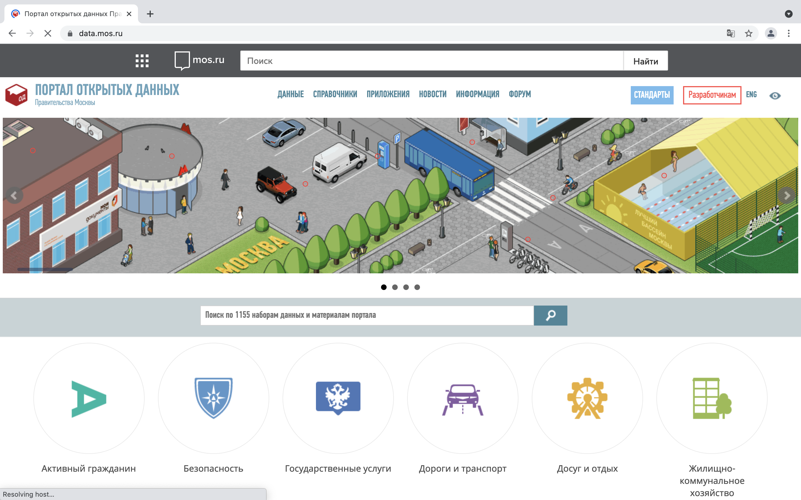

```{r setup, include=FALSE}
knitr::opts_chunk$set(echo = TRUE)

library(dplyr)
library(data.table)
library(tidyr)
library(sp)
library(sf)
library(stringr)
library(spData)
library(tmap)
library(httr)
library(mapview)
library(tmap)

```


## Портал открытых данных Правительства Москвы 
#### [https://data.mos.ru](https://data.mos.ru) содержит более 100 тематичеcких наборов, многие из них с географичеcкой привязкой





## Варианты получения данных

#### 1. Напрямую с [портала](https://data.mos.ru) -  xlsx, json, xml


####  2. Через API - geojson

-Необходимо получить API на сайте [https://apidata.mos.ru](https://apidata.mos.ru)
-формирование запроса (через браузер, через R...)

#### 3. [Утилита от Urbica](https://github.com/urbica/datamos-geojson)

-установить Node.js: https://nodejs.org/

-установить утилиту, выполнив  `npm install -g datamos-geojson` в командной строке
    
-запустить утилиту, выполнив `datamos-geojson` в командной строке 


## Как сформировать ссылку на данные, используя API

#### 1.Актуальная версия

https://apidata.mos.ru/v1/datasets/{DatasetId}/features?api_key={КЛЮЧ_API}


#### 2. Актуальная версия, обрезанная по ограничивающему контуру (bbox)

http://api.data.mos.ru/v1/datasets/{DatasetId}/features?bbox={bbox}&api_key={КЛЮЧ_API}


#### 3.Прошлые версии

https://apidata.mos.ru/v1/datasets/{DatasetId}/features?versionNumber={VersionNumber}&releaseNumber={ReleaseNumber}&api_key={КЛЮЧ_API}


##  Определяем ID датасета и ключ API

```{r set parameters, results = "hide", message = FALSE}

datasetId = "1193" #номер датасета, можно узнать в паспорте

#version = "1" #номер версии (опционально)
    
#release = "59" #номер релиза (опционально)

api_key = "b0c0ad1adf1319a3a8b1c2ed7649b21e"  #уникальный ключ API
```


## Получаем данные по ссылке

```{r get_data, results = "hide", message = FALSE}

url = paste0("https://apidata.mos.ru/v1/datasets/", datasetId,"/features?api_key=",api_key) # формирование ссылки

data_sf = url %>% st_read() #создание пространственных данных из json
        
```

## Cмотрим

```{r view_data, message = FALSE}

mapview(data_sf)        
        
```

## В одной из колонок хаос - непорядок ;)

## Атрибуты определяем в разные столбцы

```{r edit_data, message = FALSE}

data_json = url %>% readr::read_file() %>% iconv("UTF-8")

data_json_edited = mgsub::mgsub(data_json, c('\\\"Attributes\\\":\\{', '\\}\\,\"type\":\"Feature\"\\}'), c('','\\,\"type\"\\:\"Feature\"\\}')) #удаляем Attributes как группу, которая содержит в себе множетсво разных характеристик 

data_sf2 = data_json_edited %>% sf::read_sf() #создание пространственных данных из json
                
glimpse(data_sf2)  #смотрим на стркутру получившегося файла

mapview(data_sf2)  # смотрим на данные

```


## Функция, с помощью которой сразу получаем готовый для работы набор данных

```{r create function to get data }

get_datamos = function(datasetId) {
  
url = paste0("https://apidata.mos.ru/v1/datasets/", datasetId,"/features?api_key=","b0c0ad1adf1319a3a8b1c2ed7649b21e")
  
data_json = url %>% readr::read_file() %>% iconv("UTF-8")

data_json_edited = mgsub::mgsub(data_json, c('\\\"Attributes\\\":\\{', '\\}\\,\"type\":\"Feature\"\\}'), c('','\\,\"type\"\\:\"Feature\"\\}')) #удаляем Attributes как группу, которая содержит в себе множетсво разных характеристик 

data_sf = data_json_edited %>% sf::read_sf()
 
return(data_sf)
}

#получаем данные с помощью функции get_datamos
vet = get_datamos(1193)
mapview(vet)

```


## Выбираем нужные датасеты
{width=150px}

```{r call needed datasets}

ids = c(890, 60623, 1387, 886, 60624, 885,	902, 1232, 629) #номера нужных нам датасетов

sets_names = c("Waterpools", "Tennis", "Climbing", "Football", "Gym", "Regby", "Equestrian", "Ice skating", "SportHalls") #их названия


```


## Запрашиваем и ждём
{width=150px}


```{r get all datasets, results = "hide"}

#one_dataset = get_datamos(datasetId) # применение функции к одному любому датасету

datasets = lapply(ids, get_datamos) # применение функции get_datamos ко всем нужным нам датаестам 

names(datasets) <- sets_names # определение имен для всех элементов списка

```

## Смотрим

```{r creating maps, message = FALSE}

# Создаем интерактивную карту с помощью tmap с возможностью переключения слоев

colors = c("aquamarine2","yellowgreen","lightskyblue3","maroon3","tan1") # цвета, чтобы было веселее

sport_data = 0
for (i in 1:length(datasets)) {
  sport_data = sport_data+ tm_shape(datasets[[i]]) + tm_bubbles(group = sets_names[i], size = 0.1, col = colors[i]) 
} 

tmap_mode("view") # интерактивный режим tmap

sport_data %>% tmap_leaflet() %>% leaflet::hideGroup(sets_names[-1]) # отображаем все данные на карте, используем leaflet для переключения слоев

```


